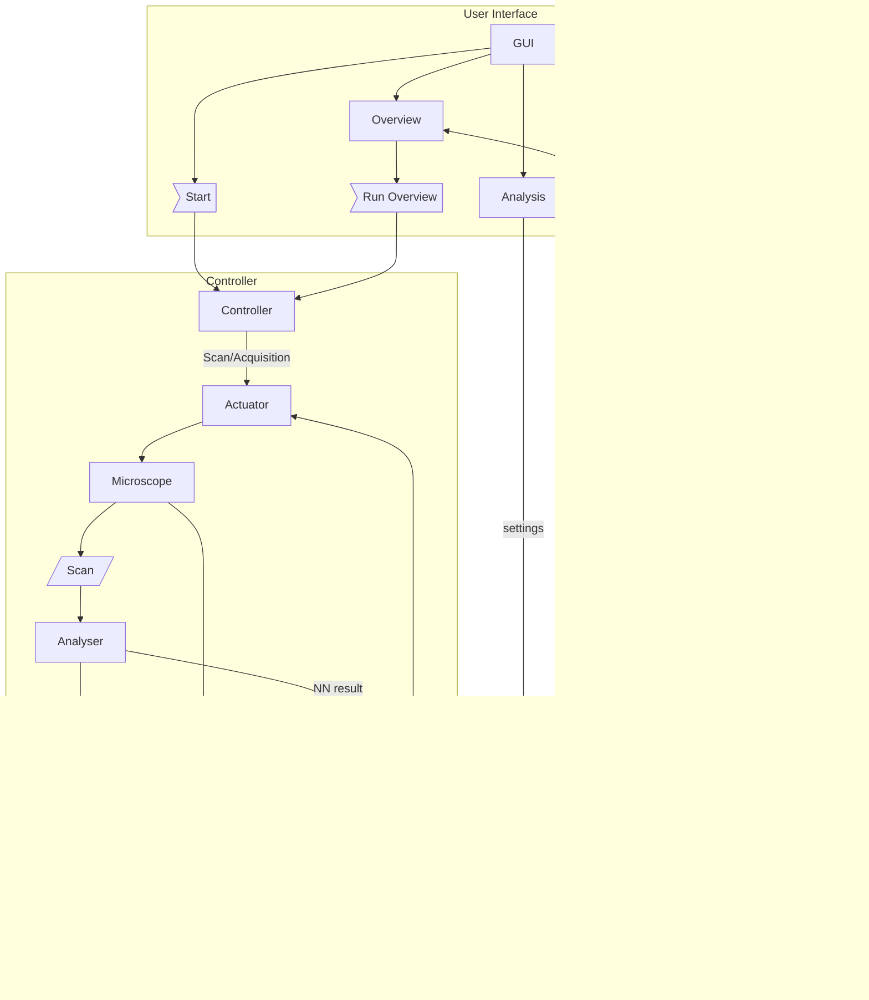

```mermaid
graph TD
    subgraph User Interface
        GUI --> Overview
        Overview --> Overview_btn>Run Overview]
        GUI --> Scan
        GUI --> Analysis
        GUI --> Acquisition
        GUI --> Start_btn>Start]
    end

    subgraph ModelSub[Model]
        Model
    end

    subgraph ControllerSub[Controller]
        Start_btn --> Controller
        Analysis -- settings --> Model

        Model --> Actuator
        Analyser -- NN result --> Interpreter

        Overview <-- MDA --> Model
        Scan <-- MDA --> Model
        Acquisition <-- MDA --> Model
        Overview_btn --> Controller

        Controller -- Scan/Acquisition --> Actuator
        Actuator --> Microscope
        Microscope --> Scan_data[/Scan/] --> Analyser
        Analyser --> Writer --> MIP --> Storage

        Microscope --> Acquisition_data[/Acquisition/] --> IMCFWriter
        IMCFWriter --> Storage
        Interpreter -- MDA --> Model

    end


```